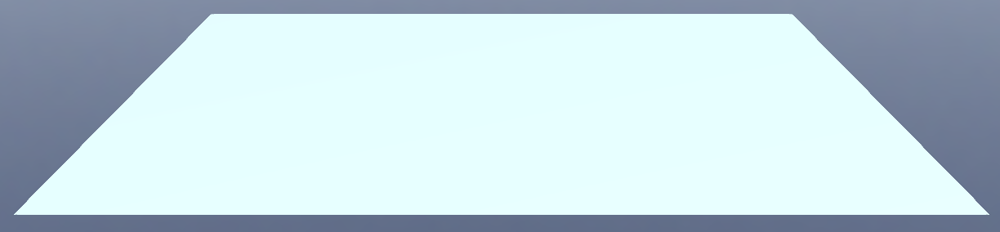
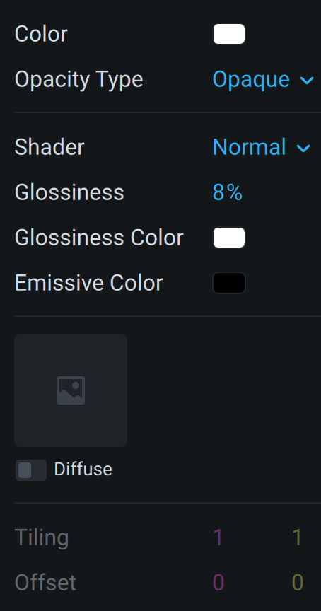
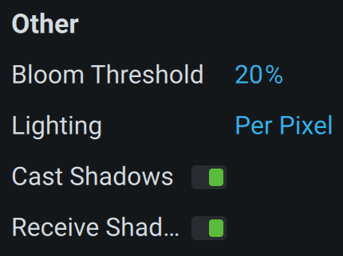

# Screenshot



# Material





# JSON

## [materials/4D48F86D-ECE2-462D-8509-5CC70644CDBC.json](materials/4D48F86D-ECE2-462D-8509-5CC70644CDBC.json)

```json
{
  "@class": "Material",
  "id": {"uuid": "4D48F86D-ECE2-462D-8509-5CC70644CDBC"},
  "renderingType": "opaque",
  "blendingType": "normal",
  "detailType": "none",
  "lightningType": "perPixel",
  "colorsType": "no",
  
  // Shader
  //  Basic
  //  Normal - colored
  //  RIM Value
  //  Glass
  //  Metal
  //  Toon
  //  Standard
  //  PBR - pbr
  //  MatCap
  "shadingType": "colored",
  
  "sideType": "front",
  "depthType": "default",
  "ambient": {"values": [0.33000001311302185,0.33000001311302185,0.33000001311302185]},
  "diffuse": {"values": [1,1,1]},
  "specular": {"values": [1,1,1]},
  "emissive": {"values": [0,0,0]},
  "rimColor": {"values": [1,1,1]},
  "opacity": 0.75,
  "shininess": 8,
  
  // Metallness
  "metalness": 1,
  
  "roughness": 1,
  "refraction": 0.5,
  "rimIntensity": 1,
  "bloomThreshold": 0.800000011920929,
  "normalScale": 1,
  "heightScale": 1,
  
  "diffuseMap":   {"uuid": "00000000-0000-0000-0000-00000000000A"},
  "normalMap":    {"uuid": "00000000-0000-0000-0000-000000000002"},
  "specularMap":  {"uuid": "00000000-0000-0000-0000-000000000003"},
  "emissiveMap":  {"uuid": "00000000-0000-0000-0000-000000000006"},
  "heightMap":    {"uuid": "00000000-0000-0000-0000-000000000004"},
  "alphaMap":     {"uuid": "00000000-0000-0000-0000-000000000001"},
  "occlusionMap": {"uuid": "00000000-0000-0000-0000-000000000005"},
  "roughnessMap": {"uuid": "00000000-0000-0000-0000-000000000008"},
  "metalnessMap": {"uuid": "00000000-0000-0000-0000-000000000007"},
  "envMap":       {"uuid": "00000000-0000-0000-0000-000000000009"},
  "irrEnvMap":    {"uuid": "00000000-0000-0000-0000-000000000010"},
  
  "cubemapSize": 256,
  "cubemapUpdateSpeed": -1,
  "tilingOffset": {"values": [1,1,0,0]},
  "toonGlare": {"values": [1,1,1]},
  "toonGradient": {
    "@class": "StdListVector3",
    "list": [
      {"values": [0.25,0.25,0.25]},
      {"values": [0.6000000238418579,0.6000000238418579,0.6000000238418579]},
      {"values": [1,1,1]}
    ]
  }
}
```

## [scenes/1C435217-1F56-4B14-B162-D5571841CD11.json](scenes/1C435217-1F56-4B14-B162-D5571841CD11.json)

```json
// ...
{
  "@class": "BaseNode",
  "color_index": 6,
  "object3D": {
    "@class": "BaseObject3D",
    "id": {"uuid": "69B3343E-0E21-4C30-8FA4-BC470CC0CAF2"},
    "name": "Item 1",
    "enabled": true,
    "visible": true,
    "hitVisible": true,
    "colliders": [
      {
        "@class": "BaseComponentCollider",
        "colliderId": {"uuid": "3BF92E38-04DF-46A6-A60E-CB76667083A9"}
      }
    ],
    "geometry": {
      "@class": "BaseComponentGeometry",
      "meshId": {"uuid": "2DFB2E0B-E99A-4A53-8D30-B57257AF17EB"},
      "static": false,
      "shadowCast": true,
      "shadowReceive": true
    },
    
    "material": {
      "@class": "BaseComponentMaterial",
      "materialId": {"uuid": "4D48F86D-ECE2-462D-8509-5CC70644CDBC"},
      "mapsStates": 0
    },
    
    "rigidBody": {
      "@class": "BaseComponentPhysBody",
      "rigidBodyId": {"uuid": "70D69DB0-8308-441B-BD47-892C70F11781"},
      "isEnabled": true
    },
    "transform": {
      "@class": "BaseComponentTransformable",
      "localTransforms": {
        "values": [
          0.03999999910593033, 0, 0,                   0,
          0,                   1, 0,                   0,
          0,                   0, 0.03999999910593033, 0,
          0,                   0, 0,                   1
        ]
      }
    },
    "metadata": {
      "importedIdentifier": "Plane_zero",
      "importedName": "Plane_zero",
      "isBone": false
    }
  }
// ...
```
